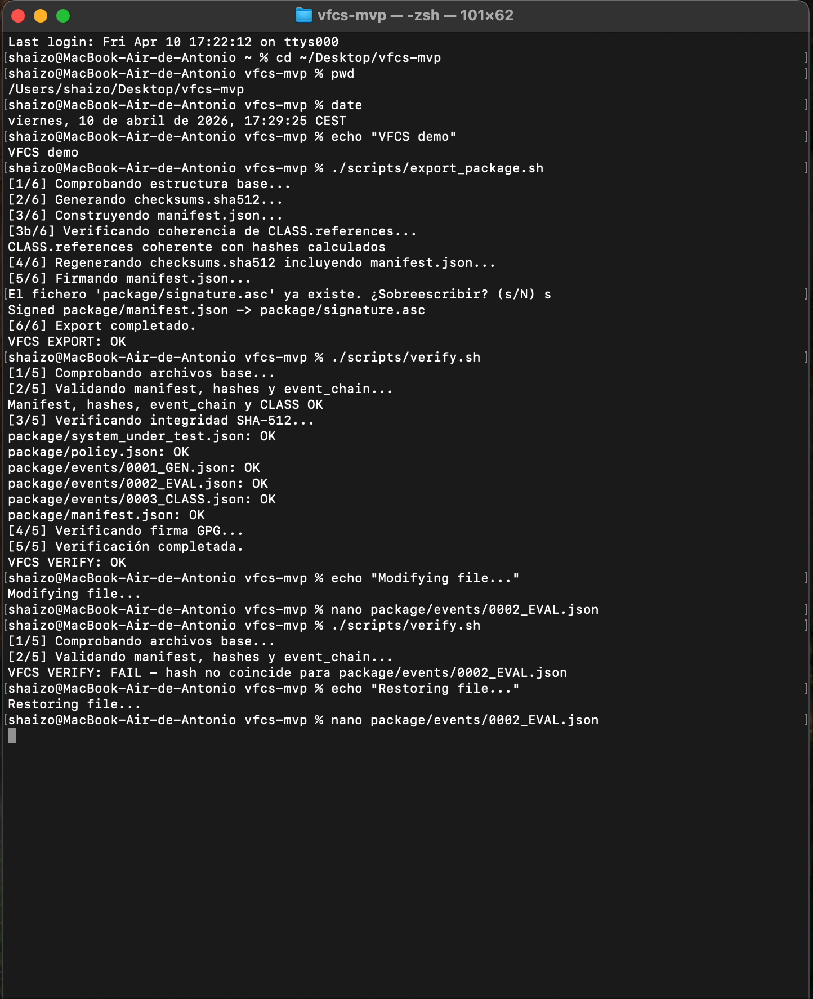
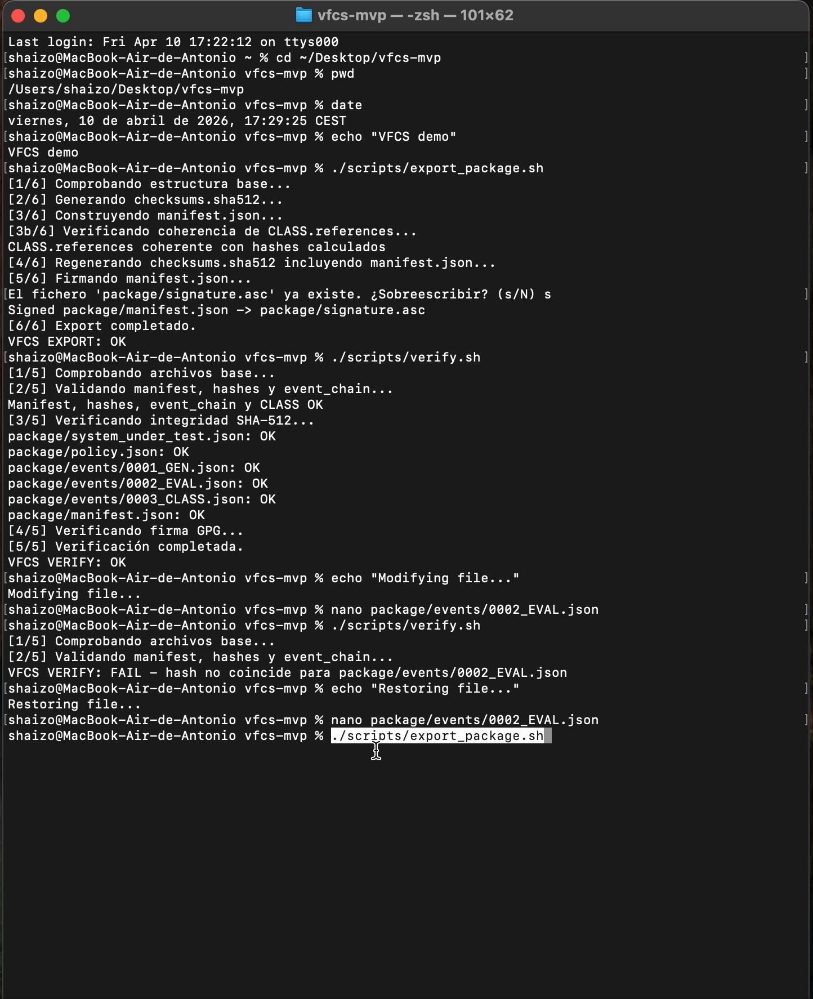
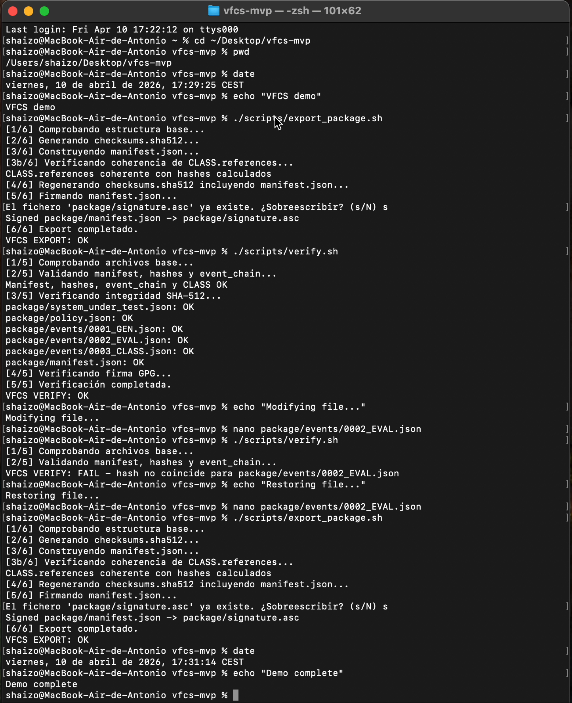

# VFCS-IA

Verifiable Flow for Critical Systems – Intelligent Architecture

A cryptographic audit layer for AI systems that makes outputs verifiable, traceable, and tamper-evident.
 
Independent research project focused on cryptographic validation, traceability, and auditability of AI system decisions.

---

## TL;DR
 
VFCS-IA is a framework that turns AI outputs into verifiable evidence using SHA-512 hashing, chained events (GEN → EVAL → CLASS), and digital signatures.

---

## What it is
 
VFCS-IA defines a structured flow to record, validate, and verify AI decisions.

It transforms AI outputs into auditable artifacts with verifiable integrity.

---

## Problem

Modern AI systems do not guarantee:
- that an output has not been modified  
- full traceability between input, process, and result  
- technical or forensic auditability  

---

## Solution

VFCS-IA introduces:
- SHA-512 hashing per element  
- chained events via hashes  
- manifest-based integrity  
- GPG digital signatures  

---

## System flow

Input → GEN → EVAL → CLASS → Manifest → Signature → Output

GEN:  
- input is recorded  

EVAL:  
- system generates output  

CLASS:  
- coherence and structural correctness are validated  

---

## Event chain

Each event generates:
- its own hash (event_sha512)  
- a chained hash including the previous state (chain_sha512)  

This creates a tamper-evident sequence.

The chained hash includes the previous event hash, forming a tamper-evident chained structure.

---

## Example

Input: request for contract summary with termination clauses  

GEN: 
- input is recorded  

EVAL:  
- system generates output  

CLASS:  
- coherence and correctness are validated  

---

## Usage

Run:

```bash
./scripts/export_package.sh
./scripts/verify.sh
./test_roundtrip.sh  # root-level test
```

Expected output:

```text
VFCS EXPORT: OK
VFCS VERIFY: OK
VFCS ROUNDTRIP: OK
```

OK → integrity verified  
FAIL → tampering detected   

---

## Demo

### Successful verification


### Tamper detection


### Package export


---

## Repository structure

```text
vfcs-ia/
├── scripts/
├── package/
│   ├── manifest.json
│   ├── checksums.sha512
│   ├── signature.asc
│   └── events/
│       ├── 0001_GEN.json
│       ├── 0002_EVAL.json
│       └── 0003_CLASS.json
├── viewer/
├── docs/
│   └── media/
│       ├── demo_ok.png
│       ├── demo_fail.png
│       └── demo_export.png
├── README.md
```

---

## Guarantees

- Verifiable integrity via SHA-512
- Tamper detection
- Full event traceability
- Independent verification

---

## Use cases

- AI audit trails
- Forensic validation
- Compliance workflows
- Secure pipelines

---

## Limitations

- Prototype (MVP)
- Does not validate full environment integrity
- Requires proper key management
- GPG signing is interactive in the MVP
- Designed for automated signing in production environments

---

## Author

Antonio Tena Salguero  
Independent developer 

---

## Intellectual Property Notice

This project is registered in the Spanish Intellectual Property Registry.

Registration number: 16/2026/2013

The registration covers the original expression, structure, and documentation of the VFCS-IA system.

This repository is released under a custom non-commercial license. Commercial use requires explicit permission from the author.

---

## License

Custom Non-Commercial License
